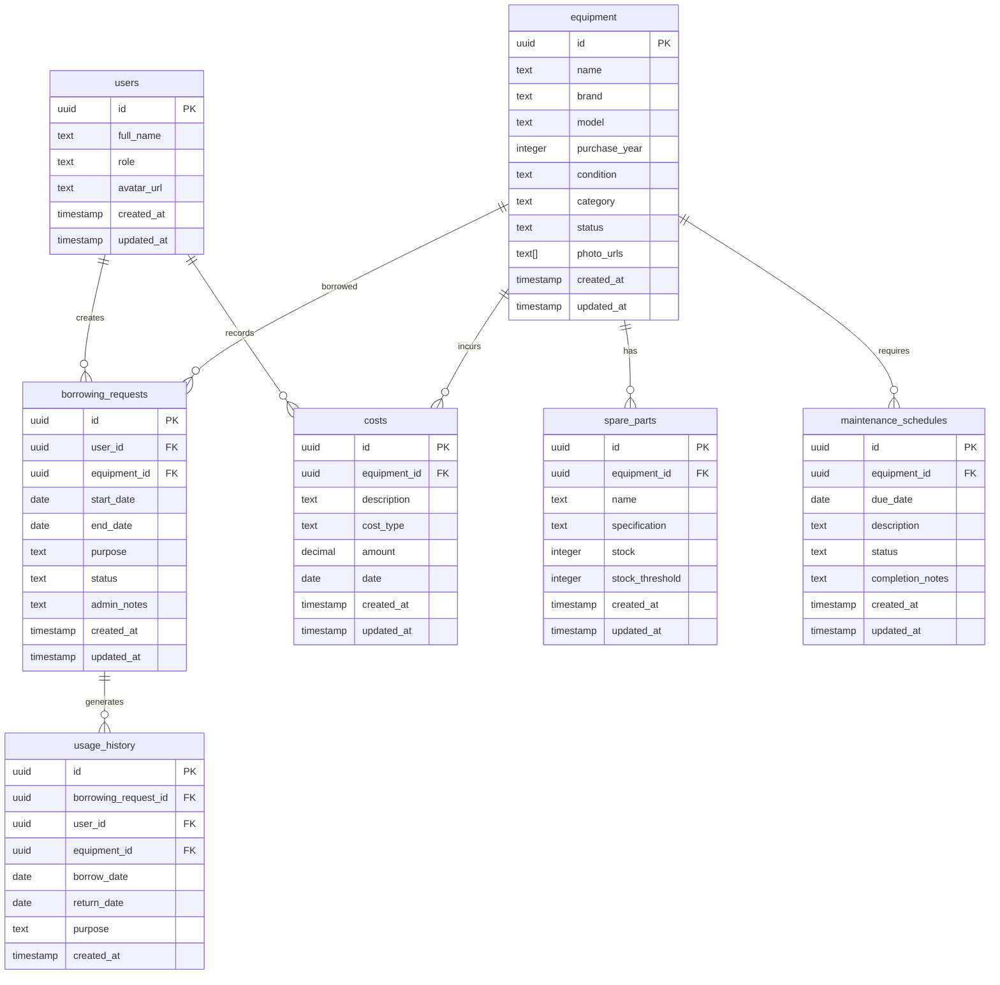

# 🗄️ Database Schema Documentation

Dokumentasi lengkap skema database **Agri-Gear Manager** menggunakan PostgreSQL melalui Supabase.

## 📋 Table of Contents

1. [Overview](#overview)
2. [Entity Relationship Diagram](#entity-relationship-diagram)
3. [Core Tables](#core-tables)
4. [Authentication Tables](#authentication-tables)
5. [Views](#views)
6. [Functions & Triggers](#functions--triggers)
7. [Row Level Security](#row-level-security)
8. [Indexes](#indexes)
9. [Migration Scripts](#migration-scripts)

## 🌐 Overview

Database menggunakan PostgreSQL dengan fitur Supabase:
- **Authentication**: Built-in auth system
- **Storage**: File storage untuk foto equipment
- **Row Level Security**: Fine-grained access control
- **Real-time**: Live updates untuk dashboard

### Design Principles
- ✅ Normalized database design
- ✅ Foreign key constraints
- ✅ Proper indexing
- ✅ Audit trails (created_at, updated_at)
- ✅ Soft deletes where applicable

## 📊 Entity Relationship Diagram



## 📁 Core Tables

### 👥 users

Tabel profil pengguna yang melengkapi auth.users bawaan Supabase.

```sql
CREATE TABLE users (
    id uuid PRIMARY KEY REFERENCES auth.users(id) ON DELETE CASCADE,
    full_name text,
    role text NOT NULL DEFAULT 'member' CHECK (role IN ('admin', 'member')),
    avatar_url text,
    created_at timestamp with time zone DEFAULT now(),
    updated_at timestamp with time zone DEFAULT now()
);
```

**Columns:**
- `id` (uuid): Primary key, references auth.users(id)
- `full_name` (text): Nama lengkap pengguna
- `role` (enum): Role pengguna ('admin' | 'member')
- `avatar_url` (text): URL foto profil
- `created_at` (timestamp): Waktu pembuatan record
- `updated_at` (timestamp): Waktu update terakhir

**Constraints:**
- CHECK constraint untuk role values
- Foreign key cascade delete ke auth.users

---

### 🔧 equipment

Tabel utama untuk manajemen peralatan pertanian.

```sql
CREATE TABLE equipment (
    id uuid PRIMARY KEY DEFAULT gen_random_uuid(),
    name text NOT NULL,
    brand text,
    model text,
    purchase_year integer CHECK (purchase_year >= 1900 AND purchase_year <= EXTRACT(YEAR FROM CURRENT_DATE) + 1),
    condition text NOT NULL DEFAULT 'Baik' CHECK (condition IN ('Baik', 'Perlu Perbaikan', 'Rusak')),
    category text NOT NULL CHECK (category IN ('Alat Berat', 'Mesin', 'Alat Tangan')),
    status text NOT NULL DEFAULT 'Tersedia' CHECK (status IN ('Tersedia', 'Dipinjam', 'Dalam Perawatan')),
    photo_urls text[],
    created_at timestamp with time zone DEFAULT now(),
    updated_at timestamp with time zone DEFAULT now()
);
```

**Columns:**
- `id` (uuid): Primary key, auto-generated
- `name` (text): Nama peralatan (required)
- `brand` (text): Merek peralatan
- `model` (text): Model peralatan
- `purchase_year` (integer): Tahun pembelian
- `condition` (enum): Kondisi peralatan
- `category` (enum): Kategori peralatan
- `status` (enum): Status ketersediaan
- `photo_urls` (text[]): Array URL foto peralatan
- `created_at` (timestamp): Waktu pembuatan
- `updated_at` (timestamp): Waktu update terakhir

**Constraints:**
- NOT NULL pada field wajib
- CHECK constraints untuk enums dan year validation
- Array type untuk multiple photo URLs

---

### 📦 borrowing_requests

Tabel untuk mengelola permintaan peminjaman peralatan.

```sql
CREATE TABLE borrowing_requests (
    id uuid PRIMARY KEY DEFAULT gen_random_uuid(),
    user_id uuid NOT NULL REFERENCES users(id) ON DELETE CASCADE,
    equipment_id uuid NOT NULL REFERENCES equipment(id) ON DELETE CASCADE,
    start_date date NOT NULL,
    end_date date NOT NULL,
    purpose text NOT NULL,
    status text NOT NULL DEFAULT 'Tertunda' CHECK (status IN ('Tertunda', 'Disetujui', 'Ditolak', 'Dikembalikan')),
    admin_notes text,
    created_at timestamp with time zone DEFAULT now(),
    updated_at timestamp with time zone DEFAULT now(),
    CONSTRAINT valid_date_range CHECK (end_date >= start_date)
);
```

**Columns:**
- `id` (uuid): Primary key
- `user_id` (uuid): ID pengguna peminjam (FK)
- `equipment_id` (uuid): ID peralatan (FK)
- `start_date` (date): Tanggal mulai peminjaman
- `end_date` (date): Tanggal selesai peminjaman
- `purpose` (text): Tujuan peminjaman
- `status` (enum): Status permintaan
- `admin_notes` (text): Catatan admin
- `created_at` (timestamp): Waktu pengajuan
- `updated_at` (timestamp): Waktu update terakhir

**Constraints:**
- Foreign keys dengan cascade delete
- CHECK constraint untuk valid date range
- CHECK constraint untuk status values

---

### 🔧 maintenance_schedules

Tabel untuk penjadwalan perawatan peralatan.

```sql
CREATE TABLE maintenance_schedules (
    id uuid PRIMARY KEY DEFAULT gen_random_uuid(),
    equipment_id uuid NOT NULL REFERENCES equipment(id) ON DELETE CASCADE,
    due_date date NOT NULL,
    description text NOT NULL,
    status text NOT NULL DEFAULT 'Dijadwalkan' CHECK (status IN ('Dijadwalkan', 'Selesai', 'Dibatalkan')),
    completion_notes text,
    created_at timestamp with time zone DEFAULT now(),
    updated_at timestamp with time zone DEFAULT now()
);
```

**Columns:**
- `id` (uuid): Primary key
- `equipment_id` (uuid): ID peralatan (FK)
- `due_date` (date): Tanggal jatuh tempo perawatan
- `description` (text): Deskripsi perawatan
- `status` (enum): Status jadwal perawatan
- `completion_notes` (text): Catatan penyelesaian
- `created_at` (timestamp): Waktu pembuatan jadwal
- `updated_at` (timestamp): Waktu update terakhir

---

### 🔩 spare_parts

Tabel untuk manajemen suku cadang peralatan.

```sql
CREATE TABLE spare_parts (
    id uuid PRIMARY KEY DEFAULT gen_random_uuid(),
    equipment_id uuid NOT NULL REFERENCES equipment(id) ON DELETE CASCADE,
    name text NOT NULL,
    specification text,
    stock integer NOT NULL DEFAULT 0 CHECK (stock >= 0),
    stock_threshold integer NOT NULL DEFAULT 1 CHECK (stock_threshold >= 0),
    created_at timestamp with time zone DEFAULT now(),
    updated_at timestamp with time zone DEFAULT now()
);
```

**Columns:**
- `id` (uuid): Primary key
- `equipment_id` (uuid): ID peralatan (FK)
- `name` (text): Nama suku cadang
- `specification` (text): Spesifikasi suku cadang
- `stock` (integer): Jumlah stok saat ini
- `stock_threshold` (integer): Ambang batas minimum stok
- `created_at` (timestamp): Waktu pembuatan
- `updated_at` (timestamp): Waktu update terakhir

**Constraints:**
- CHECK constraints untuk non-negative values
- Foreign key cascade delete

---

### 💰 costs

Tabel untuk pencatatan biaya operasional peralatan.

```sql
CREATE TABLE costs (
    id uuid PRIMARY KEY DEFAULT gen_random_uuid(),
    equipment_id uuid NOT NULL REFERENCES equipment(id) ON DELETE CASCADE,
    description text NOT NULL,
    cost_type text NOT NULL,
    amount decimal(15,2) NOT NULL CHECK (amount >= 0),
    date date NOT NULL,
    created_at timestamp with time zone DEFAULT now(),
    updated_at timestamp with time zone DEFAULT now()
);
```

**Columns:**
- `id` (uuid): Primary key
- `equipment_id` (uuid): ID peralatan (FK)
- `description` (text): Deskripsi biaya
- `cost_type` (text): Jenis biaya (Maintenance, Fuel, etc.)
- `amount` (decimal): Jumlah biaya
- `date` (date): Tanggal biaya
- `created_at` (timestamp): Waktu pencatatan
- `updated_at` (timestamp): Waktu update terakhir

**Constraints:**
- CHECK constraint untuk amount non-negative
- Decimal precision 15,2 untuk currency handling

---

### 📊 usage_history

Tabel untuk menyimpan riwayat penggunaan peralatan.

```sql
CREATE TABLE usage_history (
    id uuid PRIMARY KEY DEFAULT gen_random_uuid(),
    borrowing_request_id uuid REFERENCES borrowing_requests(id) ON DELETE CASCADE,
    user_id uuid NOT NULL REFERENCES users(id) ON DELETE CASCADE,
    equipment_id uuid NOT NULL REFERENCES equipment(id) ON DELETE CASCADE,
    borrow_date date NOT NULL,
    return_date date,
    purpose text NOT NULL,
    created_at timestamp with time zone DEFAULT now(),
    CONSTRAINT valid_usage_dates CHECK (return_date IS NULL OR return_date >= borrow_date)
);
```

**Columns:**
- `id` (uuid): Primary key
- `borrowing_request_id` (uuid): ID permintaan peminjaman (FK, nullable)
- `user_id` (uuid): ID pengguna (FK)
- `equipment_id` (uuid): ID peralatan (FK)
- `borrow_date` (date): Tanggal peminjaman
- `return_date` (date): Tanggal pengembalian (nullable)
- `purpose` (text): Tujuan penggunaan
- `created_at` (timestamp): Waktu pembuatan record

## 🔐 Authentication Tables

Menggunakan built-in Supabase auth system:

### auth.users (Built-in)
```sql
-- Supabase managed table
auth.users (
    id uuid PRIMARY KEY,
    email text UNIQUE,
    encrypted_password text,
    email_confirmed_at timestamp,
    created_at timestamp,
    updated_at timestamp,
    -- ... other auth fields
)
```

## 👁️ Views

### detailed_borrowing_requests

View untuk menampilkan data peminjaman dengan detail user dan equipment.

```sql
CREATE VIEW detailed_borrowing_requests AS
SELECT 
    br.*,
    u.full_name as user_name,
    u.role as user_role,
    au.email as user_email,
    e.name as equipment_name,
    e.category as equipment_category,
    e.brand as equipment_brand,
    e.model as equipment_model
FROM borrowing_requests br
LEFT JOIN users u ON br.user_id = u.id
LEFT JOIN auth.users au ON u.id = au.id
LEFT JOIN equipment e ON br.equipment_id = e.id;
```

### detailed_usage_history

View untuk analisis riwayat penggunaan.

```sql
CREATE VIEW detailed_usage_history AS
SELECT 
    uh.*,
    u.full_name as user_name,
    au.email as user_email,
    e.name as equipment_name,
    e.category as equipment_category,
    e.brand as equipment_brand
FROM usage_history uh
LEFT JOIN users u ON uh.user_id = u.id
LEFT JOIN auth.users au ON u.id = au.id
LEFT JOIN equipment e ON uh.equipment_id = e.id;
```

### equipment_statistics

View untuk statistik peralatan.

```sql
CREATE VIEW equipment_statistics AS
SELECT 
    e.*,
    COUNT(DISTINCT br.id) as total_borrowings,
    COUNT(DISTINCT sp.id) as spare_parts_count,
    COALESCE(SUM(c.amount), 0) as total_costs,
    COUNT(DISTINCT ms.id) as maintenance_count
FROM equipment e
LEFT JOIN borrowing_requests br ON e.id = br.equipment_id
LEFT JOIN spare_parts sp ON e.id = sp.equipment_id
LEFT JOIN costs c ON e.id = c.equipment_id
LEFT JOIN maintenance_schedules ms ON e.id = ms.equipment_id
GROUP BY e.id;
```

## ⚡ Functions & Triggers

### Auto-update timestamp function

```sql
CREATE OR REPLACE FUNCTION update_updated_at_column()
RETURNS TRIGGER AS $$
BEGIN
    NEW.updated_at = now();
    RETURN NEW;
END;
$$ language 'plpgsql';
```

### Apply triggers to all tables

```sql
-- Users table
CREATE TRIGGER update_users_updated_at BEFORE UPDATE ON users
    FOR EACH ROW EXECUTE FUNCTION update_updated_at_column();

-- Equipment table
CREATE TRIGGER update_equipment_updated_at BEFORE UPDATE ON equipment
    FOR EACH ROW EXECUTE FUNCTION update_updated_at_column();

-- Borrowing requests table
CREATE TRIGGER update_borrowing_requests_updated_at BEFORE UPDATE ON borrowing_requests
    FOR EACH ROW EXECUTE FUNCTION update_updated_at_column();

-- Maintenance schedules table
CREATE TRIGGER update_maintenance_schedules_updated_at BEFORE UPDATE ON maintenance_schedules
    FOR EACH ROW EXECUTE FUNCTION update_updated_at_column();

-- Spare parts table
CREATE TRIGGER update_spare_parts_updated_at BEFORE UPDATE ON spare_parts
    FOR EACH ROW EXECUTE FUNCTION update_updated_at_column();

-- Costs table
CREATE TRIGGER update_costs_updated_at BEFORE UPDATE ON costs
    FOR EACH ROW EXECUTE FUNCTION update_updated_at_column();
```

### Automatic usage history creation

```sql
CREATE OR REPLACE FUNCTION create_usage_history()
RETURNS TRIGGER AS $$
BEGIN
    -- Create usage history when borrowing request is returned
    IF NEW.status = 'Dikembalikan' AND OLD.status != 'Dikembalikan' THEN
        INSERT INTO usage_history (
            borrowing_request_id,
            user_id,
            equipment_id,
            borrow_date,
            return_date,
            purpose
        ) VALUES (
            NEW.id,
            NEW.user_id,
            NEW.equipment_id,
            NEW.start_date,
            CURRENT_DATE,
            NEW.purpose
        );
        
        -- Update equipment status back to available
        UPDATE equipment 
        SET status = 'Tersedia' 
        WHERE id = NEW.equipment_id;
    END IF;
    
    -- Update equipment status when request is approved
    IF NEW.status = 'Disetujui' AND OLD.status = 'Tertunda' THEN
        UPDATE equipment 
        SET status = 'Dipinjam' 
        WHERE id = NEW.equipment_id;
    END IF;
    
    RETURN NEW;
END;
$$ language 'plpgsql';

CREATE TRIGGER borrowing_status_trigger 
    AFTER UPDATE OF status ON borrowing_requests
    FOR EACH ROW EXECUTE FUNCTION create_usage_history();
```

## 🛡️ Row Level Security (RLS)

### Enable RLS on all tables

```sql
ALTER TABLE users ENABLE ROW LEVEL SECURITY;
ALTER TABLE equipment ENABLE ROW LEVEL SECURITY;
ALTER TABLE borrowing_requests ENABLE ROW LEVEL SECURITY;
ALTER TABLE maintenance_schedules ENABLE ROW LEVEL SECURITY;
ALTER TABLE spare_parts ENABLE ROW LEVEL SECURITY;
ALTER TABLE costs ENABLE ROW LEVEL SECURITY;
ALTER TABLE usage_history ENABLE ROW LEVEL SECURITY;
```

### Users table policies

```sql
-- Users can view their own profile
CREATE POLICY "Users can view own profile" ON users
    FOR SELECT USING (auth.uid() = id);

-- Users can update their own profile
CREATE POLICY "Users can update own profile" ON users
    FOR UPDATE USING (auth.uid() = id);

-- Admins can view all users
CREATE POLICY "Admins can view all users" ON users
    FOR SELECT USING (
        EXISTS (
            SELECT 1 FROM users 
            WHERE users.id = auth.uid() 
            AND users.role = 'admin'
        )
    );

-- Admins can update user roles
CREATE POLICY "Admins can update users" ON users
    FOR UPDATE USING (
        EXISTS (
            SELECT 1 FROM users 
            WHERE users.id = auth.uid() 
            AND users.role = 'admin'
        )
    );
```

### Equipment table policies

```sql
-- Everyone can view equipment
CREATE POLICY "Anyone can view equipment" ON equipment
    FOR SELECT USING (true);

-- Only admins can manage equipment
CREATE POLICY "Admins can manage equipment" ON equipment
    FOR ALL USING (
        EXISTS (
            SELECT 1 FROM users 
            WHERE users.id = auth.uid() 
            AND users.role = 'admin'
        )
    );
```

### Borrowing requests policies

```sql
-- Users can view their own requests
CREATE POLICY "Users can view own requests" ON borrowing_requests
    FOR SELECT USING (auth.uid() = user_id);

-- Users can create requests
CREATE POLICY "Users can create requests" ON borrowing_requests
    FOR INSERT WITH CHECK (auth.uid() = user_id);

-- Admins can view all requests
CREATE POLICY "Admins can view all requests" ON borrowing_requests
    FOR SELECT USING (
        EXISTS (
            SELECT 1 FROM users 
            WHERE users.id = auth.uid() 
            AND users.role = 'admin'
        )
    );

-- Admins can update request status
CREATE POLICY "Admins can update requests" ON borrowing_requests
    FOR UPDATE USING (
        EXISTS (
            SELECT 1 FROM users 
            WHERE users.id = auth.uid() 
            AND users.role = 'admin'
        )
    );
```

## 📈 Indexes

### Performance indexes

```sql
-- Equipment indexes
CREATE INDEX idx_equipment_status ON equipment(status);
CREATE INDEX idx_equipment_category ON equipment(category);
CREATE INDEX idx_equipment_condition ON equipment(condition);
CREATE INDEX idx_equipment_name ON equipment USING gin(to_tsvector('english', name));

-- Borrowing requests indexes
CREATE INDEX idx_borrowing_requests_user_id ON borrowing_requests(user_id);
CREATE INDEX idx_borrowing_requests_equipment_id ON borrowing_requests(equipment_id);
CREATE INDEX idx_borrowing_requests_status ON borrowing_requests(status);
CREATE INDEX idx_borrowing_requests_dates ON borrowing_requests(start_date, end_date);

-- Maintenance schedules indexes
CREATE INDEX idx_maintenance_schedules_equipment_id ON maintenance_schedules(equipment_id);
CREATE INDEX idx_maintenance_schedules_due_date ON maintenance_schedules(due_date);
CREATE INDEX idx_maintenance_schedules_status ON maintenance_schedules(status);

-- Spare parts indexes
CREATE INDEX idx_spare_parts_equipment_id ON spare_parts(equipment_id);
CREATE INDEX idx_spare_parts_stock ON spare_parts(stock, stock_threshold);

-- Costs indexes
CREATE INDEX idx_costs_equipment_id ON costs(equipment_id);
CREATE INDEX idx_costs_date ON costs(date);
CREATE INDEX idx_costs_type ON costs(cost_type);

-- Usage history indexes
CREATE INDEX idx_usage_history_user_id ON usage_history(user_id);
CREATE INDEX idx_usage_history_equipment_id ON usage_history(equipment_id);
CREATE INDEX idx_usage_history_dates ON usage_history(borrow_date, return_date);
```

### Composite indexes for common queries

```sql
-- Equipment by category and status
CREATE INDEX idx_equipment_category_status ON equipment(category, status);

-- Borrowing requests by status and dates
CREATE INDEX idx_borrowing_requests_status_dates ON borrowing_requests(status, start_date, end_date);

-- Maintenance by equipment and status
CREATE INDEX idx_maintenance_equipment_status ON maintenance_schedules(equipment_id, status);
```

## 📜 Migration Scripts

### Initial schema migration

```sql
-- migrations/001_initial_schema.sql

-- Create users table
CREATE TABLE users (
    id uuid PRIMARY KEY REFERENCES auth.users(id) ON DELETE CASCADE,
    full_name text,
    role text NOT NULL DEFAULT 'member' CHECK (role IN ('admin', 'member')),
    avatar_url text,
    created_at timestamp with time zone DEFAULT now(),
    updated_at timestamp with time zone DEFAULT now()
);

-- Create equipment table
CREATE TABLE equipment (
    id uuid PRIMARY KEY DEFAULT gen_random_uuid(),
    name text NOT NULL,
    brand text,
    model text,
    purchase_year integer CHECK (purchase_year >= 1900 AND purchase_year <= EXTRACT(YEAR FROM CURRENT_DATE) + 1),
    condition text NOT NULL DEFAULT 'Baik' CHECK (condition IN ('Baik', 'Perlu Perbaikan', 'Rusak')),
    category text NOT NULL CHECK (category IN ('Alat Berat', 'Mesin', 'Alat Tangan')),
    status text NOT NULL DEFAULT 'Tersedia' CHECK (status IN ('Tersedia', 'Dipinjam', 'Dalam Perawatan')),
    photo_urls text[],
    created_at timestamp with time zone DEFAULT now(),
    updated_at timestamp with time zone DEFAULT now()
);

-- ... continue with all tables

-- Create indexes
CREATE INDEX idx_equipment_status ON equipment(status);
-- ... continue with all indexes

-- Enable RLS
ALTER TABLE users ENABLE ROW LEVEL SECURITY;
-- ... continue with all tables

-- Create policies
CREATE POLICY "Users can view own profile" ON users
    FOR SELECT USING (auth.uid() = id);
-- ... continue with all policies
```

### Storage setup migration

```sql
-- migrations/002_storage_setup.sql

-- Create bucket for equipment photos
INSERT INTO storage.buckets (id, name, public)
VALUES ('equipment-photos', 'equipment-photos', true);

-- Create storage policies
CREATE POLICY "Anyone can view equipment photos" ON storage.objects
    FOR SELECT USING (bucket_id = 'equipment-photos');

CREATE POLICY "Authenticated users can upload equipment photos" ON storage.objects
    FOR INSERT WITH CHECK (
        bucket_id = 'equipment-photos' 
        AND auth.role() = 'authenticated'
    );

CREATE POLICY "Users can update their uploaded photos" ON storage.objects
    FOR UPDATE USING (
        bucket_id = 'equipment-photos' 
        AND auth.uid()::text = (storage.foldername(name))[1]
    );
```

## 📊 Sample Data

### Insert sample data for testing

```sql
-- Sample users (after manual registration)
UPDATE users SET role = 'admin' WHERE email = 'admin@example.com';

-- Sample equipment
INSERT INTO equipment (name, brand, model, purchase_year, condition, category, status) VALUES
('Traktor Kubota L3301', 'Kubota', 'L3301', 2023, 'Baik', 'Alat Berat', 'Tersedia'),
('Bajak Singkal 2 Row', 'Yanmar', 'YR-2', 2022, 'Baik', 'Alat Tangan', 'Tersedia'),
('Mesin Pompa Air', 'Honda', 'WB20XT', 2021, 'Perlu Perbaikan', 'Mesin', 'Tersedia');

-- Sample spare parts
INSERT INTO spare_parts (equipment_id, name, specification, stock, stock_threshold) VALUES
((SELECT id FROM equipment WHERE name = 'Traktor Kubota L3301'), 'Filter Oli', '15208-65F0C', 5, 2),
((SELECT id FROM equipment WHERE name = 'Traktor Kubota L3301'), 'Filter Udara', '15221-11083', 3, 1);
```

## 🔍 Query Examples

### Common queries for the application

```sql
-- Get available equipment with search
SELECT * FROM equipment 
WHERE status = 'Tersedia' 
AND name ILIKE '%traktor%'
ORDER BY name;

-- Get pending borrowing requests with user details
SELECT br.*, u.full_name, au.email, e.name as equipment_name
FROM borrowing_requests br
JOIN users u ON br.user_id = u.id
JOIN auth.users au ON u.id = au.id
JOIN equipment e ON br.equipment_id = e.id
WHERE br.status = 'Tertunda'
ORDER BY br.created_at DESC;

-- Get equipment with low spare parts stock
SELECT e.name, sp.name as spare_part, sp.stock, sp.stock_threshold
FROM equipment e
JOIN spare_parts sp ON e.id = sp.equipment_id
WHERE sp.stock <= sp.stock_threshold;

-- Get monthly equipment usage statistics
SELECT 
    e.name,
    COUNT(*) as usage_count,
    AVG(uh.return_date - uh.borrow_date) as avg_usage_days
FROM usage_history uh
JOIN equipment e ON uh.equipment_id = e.id
WHERE uh.borrow_date >= date_trunc('month', CURRENT_DATE)
GROUP BY e.id, e.name
ORDER BY usage_count DESC;
```

---

*Database schema ini dirancang untuk skalabilitas dan performa optimal. Untuk pertanyaan teknis, silakan hubungi tim development.*
